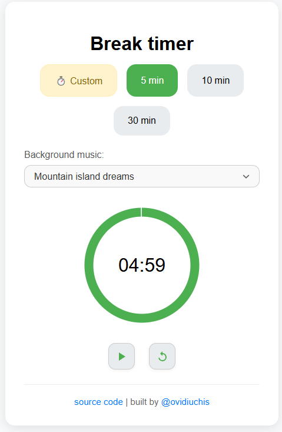

# 🕒 Break Timer

Un timer web elegant și simplu pentru pauze eficiente în timpul sesiunilor de lucru. Oferă intervale de timp personalizabile și opțional muzică de fundal relaxantă pentru a te ajuta să rămâi concentrat și productiv.



🔗 **Live Demo**: [https://ovidiuchis.github.io/timer](https://ovidiuchis.github.io/timer)

---

## ✨ Caracteristici

- ⏱️ **Timer predefinit**: Acces rapid la durate de pauză frecvente (5, 10, 30 minute)
- ✍️ **Timer personalizat**: Introdu orice durată dorești
- 🎵 **Muzică de fundal**: Alege dintre piese relaxante sau lucrează în liniște
- 🌀 **Indicator vizual**: Urmărește timpul rămas cu un progres circular animat
- 📱 **Design responsive**: Funcționează perfect pe desktop și mobil

---

## 🚀 Începe rapid

### 🔧 Cerințe

- Orice browser modern (Chrome, Firefox, Safari, Edge)

### 📦 Instalare

1. Clonează repository-ul:

   ```bash
   git clone https://github.com/ovidiuchis/timer.git
   ```

2. Intră în directorul proiectului:

   ```bash
   cd timer
   ```

3. Rulează aplicația:

   - **Opțiunea 1**: Deschide `index.html` cu un server local (recomandat)
     ```bash
     # cu Python
     python -m http.server
     # sau Live Server în VSCode
     ```
   - **Opțiunea 2**: Deschide direct `index.html` _(nu recomandat pentru că fișierele JSON nu vor fi încărcate corect din cauza CORS)_

---

## 🧠 Cum se folosește

1. **Alege durata pauzei**:

   - Click pe 5, 10 sau 30 minute
   - Sau selectează "Custom" și introdu durata dorită

2. **Alege muzica de fundal** _(opțional)_:

   - Selectează din listă sau alege "No music"

3. **Controlează timer-ul**:
   - ▶️ Play — pornește pauza
   - ⏸️ Pause — întrerupe pauza
   - 🔁 Reset — revine la timpul inițial

---

## 🛠️ Tehnologii folosite

- HTML5
- CSS3
- Vanilla JavaScript

---

## 🔧 Personalizare

### ⏱️ Adaugă timere personalizate

Editează fișierul `assets/times.json`:

```json
[
  { "label": "5 min", "minutes": 5 },
  { "label": "10 min", "minutes": 10 },
  { "label": "30 min", "minutes": 30 }
]
```

### 🎶 Adaugă muzică personalizată

Editează `assets/music.json`:

```json
[
  {
    "name": "Track Name",
    "url": "link-catre-fisierul-tau-audio.mp3"
  }
]
```

---

## 🤝 Contribuie

Contribuțiile sunt binevenite! Dacă ai idei sau îmbunătățiri:

- Deschide un **issue**
- Trimite un **pull request**

---

## 📄 Licență

Free to 🖤, free tu use 🚀

---

## 🙏 Mulțumiri

- Muzică oferită de [Free Music Archive](https://freemusicarchive.org/)
- Iconițe de la [Material Design Icons](https://material.io/resources/icons/)

---

## 👨‍💻 Autor

- **Ovidiu Chis** – [@ovidiuchis](https://github.com/ovidiuchis)  
  🌐 [ovidiuchis.github.io](http://ovidiuchis.github.io/)
